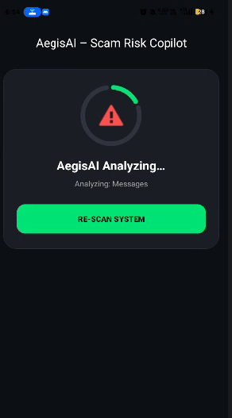
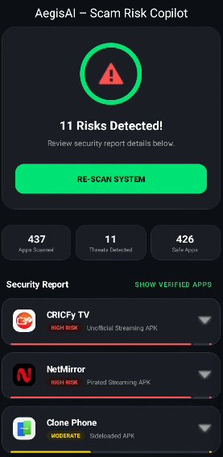
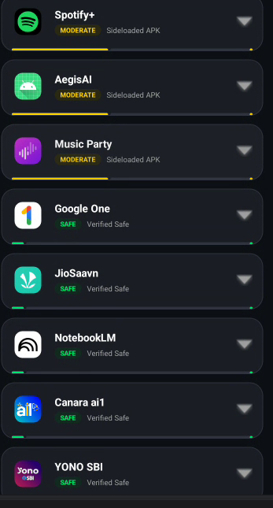
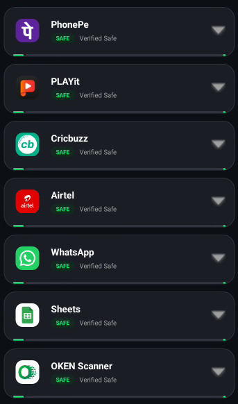

# AegisAI - Mobile Risk Analysis & Threat Detection

## Overview

AegisAI is an Android application that helps users identify potentially risky applications installed on their devices.

The application scans all installed apps, analyzes their installation sources, evaluates risk levels, and generates a security report. Users can review threat details, user feedback, security recommendations, and remove suspicious applications directly from the app.

The goal of AegisAI is to improve mobile security awareness and help users make informed decisions about the applications installed on their devices.

---

## Features

### Application Scanning
- Scans all installed applications on the device.
- Generates a complete security report.

### Risk Classification
Applications are categorized as:
- High Risk
- Moderate Risk
- Safe

### Installation Source Verification
- Verifies whether applications are installed from trusted app stores.
- Detects applications installed through unknown or sideloaded APK sources.

### Threat Detection
- Compares installed applications against a local threat metadata database.
- Identifies potentially risky applications.

### Security Dashboard
Provides:
- Total Apps Scanned
- Threats Detected
- Safe Applications

### Risk Analysis
- Displays detailed explanations for flagged applications.
- Shows threat descriptions and risk information.

### User Feedback and Reviews
- Displays user ratings and reported experiences.
- Helps users understand potential risks associated with an application.

### Security Recommendations
- Provides recommendations based on detected threats.

### One-Tap App Removal
- Allows users to uninstall suspicious applications directly from the report.

### Local Result Storage
- Saves scan results locally using Shared Preferences.
- Allows users to view previous scan reports without rescanning.

---

## Screenshots

### Scan Analysis


### Security Dashboard


### Threat Detection Report


### Detailed Risk Analysis


### Safe Applications


---

## Technology Stack

| Category | Technology |
|-----------|-----------|
| Language | Kotlin |
| UI | XML Layouts, ViewBinding |
| Design | Material Design 3 |
| Concurrency | Kotlin Coroutines |
| Storage | Shared Preferences |
| JSON Parsing | Gson |
| Components | RecyclerView, Services, Broadcast Receivers |
| Android APIs | PackageManager |

---

## How It Works

1. Loads threat metadata from a local JSON database.
2. Retrieves installed applications using PackageManager.
3. Verifies installation sources.
4. Applies risk scoring logic.
5. Categorizes applications as High Risk, Moderate Risk, or Safe.
6. Displays results in an interactive dashboard.
7. Stores scan results for future reference.

---

## Project Structure

```text
app/
├── MainActivity.kt
├── AppRiskAdapter.kt
├── AppRiskModel.kt
├── ScamShieldService.kt
├── RealTimeShieldReceiver.kt
├── assets/
│   └── app_risk_metadata.json
└── res/
    ├── layout/
    ├── drawable/
    ├── values/
    └── xml/
```

---

## Installation

Clone the repository:

```bash
git clone https://github.com/Suchendra-018/Ageis-Scan-App.git
```

Open the project in Android Studio.

Requirements:
- Android Studio Hedgehog or newer
- Android SDK 34+

Build and run the application on an emulator or physical Android device.

---

## Future Improvements

- Real-time threat monitoring
- Permission-based risk analysis
- Machine learning threat prediction
- Cloud-based threat intelligence integration
- Security report export

---

## Author

Suchendra A

Information Science Engineering Student

Android Development | Cybersecurity | Software Engineering