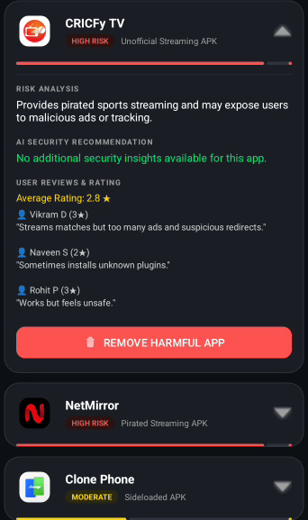

# AegisAI - Mobile Risk Analysis & Threat Detection

## Overview

AegisAI is an Android security application designed to help users identify potentially risky applications installed on their devices.

The application scans installed apps, verifies their installation sources, evaluates risk levels, and provides detailed security information. It helps users understand whether an application is safe, suspicious, or potentially harmful by analyzing local threat metadata and installation patterns.

In addition to risk analysis, the application provides user-reported reviews, threat reports, security recommendations, and an option to remove suspicious applications directly from the device.

The primary goal of AegisAI is to improve mobile security awareness and help users make informed decisions about the applications they use.

---

## Features

### Application Scanning
- Scans all installed applications on the device.
- Generates a complete security assessment report.

### Risk Classification
Applications are categorized into:
- High Risk
- Moderate Risk
- Safe

### Installation Source Verification
- Verifies whether applications were installed from trusted app stores.
- Detects applications installed from unknown or sideloaded sources.

### Threat Detection
- Uses a local threat metadata database to identify potentially risky applications.
- Highlights applications that match known threat patterns.

### Security Dashboard
Provides a summary of:
- Total Applications Scanned
- Threats Detected
- Safe Applications
- Risk Distribution

### Detailed Risk Analysis
Displays:
- Risk Level
- Risk Score
- Threat Description
- Detection Reason
- Security Recommendation

### User Reviews and Reports
- Displays user experiences and reports related to suspicious applications.
- Helps users understand real-world risks associated with flagged applications.

### Security Recommendations
- Provides guidance based on detected threats.
- Suggests actions users can take to improve device security.

### Application Removal
- Allows users to uninstall suspicious applications directly from the report.

### Local Scan History
- Stores scan results locally.
- Allows users to review previous reports without performing another scan.

---

## Screenshots

### Application Scan


### Security Dashboard


### Threat Detection Report


### Detailed Risk Analysis


### User Reviews and Reports


### Safe Applications


---

## Technology Stack

| Category | Technology |
|----------|------------|
| Language | Kotlin |
| User Interface | XML Layouts, ViewBinding |
| Design System | Material Design 3 |
| Concurrency | Kotlin Coroutines |
| Data Storage | Shared Preferences |
| JSON Processing | Gson |
| Android APIs | PackageManager |
| UI Components | RecyclerView |
| Background Components | Services, Broadcast Receivers |

---

## How It Works

1. Loads threat metadata from a local JSON database.
2. Retrieves installed application information using Android PackageManager.
3. Verifies the installation source of each application.
4. Applies risk analysis and threat detection rules.
5. Calculates risk scores and assigns categories.
6. Displays results in an interactive dashboard.
7. Provides detailed reports and security recommendations.
8. Stores scan results locally for future review.

---

## Project Structure

```text
app/
├── MainActivity.kt
├── AppRiskAdapter.kt
├── AppRiskModel.kt
├── ScamShieldService.kt
├── RealTimeShieldReceiver.kt
├── assets/
│   └── app_risk_metadata.json
└── res/
    ├── layout/
    ├── drawable/
    ├── values/
    └── xml/
```

---

## Installation

Clone the repository:

```bash
git clone https://github.com/Suchendra-018/Ageis-Scan-App.git
```

Open the project in Android Studio.

Requirements:
- Android Studio Hedgehog or newer
- Android SDK 34 or above

Build and run the application on an Android emulator or physical device.

---

## Future Enhancements

- Real-time threat monitoring
- Permission-based risk analysis
- Machine learning based threat prediction
- Cloud-based threat intelligence integration
- Security report export
- Advanced privacy auditing

---

## Author

Suchendra A

Information Science Engineering Student

Android Development, Cybersecurity, and Software Engineering