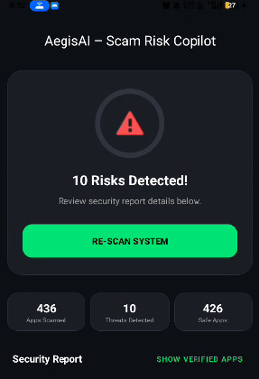

# AegisAI - Mobile Risk Analysis & Threat Detection

## Overview

AegisAI is an Android application that helps users identify potentially risky applications installed on their devices. The app analyzes installed applications, verifies their installation sources, and assigns risk levels based on predefined threat information.

The goal of the project is to provide users with a simple security audit of their device and help them identify suspicious, unsafe, or potentially harmful applications.

## Features

### Application Scanning

Scans all installed applications on the device and analyzes them for potential security risks.

### Risk Classification

Applications are categorized into:

* High Risk
* Moderate Risk
* Safe

### Installation Source Verification

Checks whether applications were installed from trusted sources such as:

* Google Play Store
* Samsung Galaxy Store
* Amazon Appstore

Applications installed from unknown sources are marked for further review.

### Threat Detection

Matches installed applications against a local threat metadata database and identifies known risky applications.

### System App Recognition

Identifies trusted system applications and reduces false positive detections.

### Detailed Risk Information

Provides information about:

* Risk level
* Threat description
* Risk score
* Detection reason

### Application Removal

Allows users to uninstall suspicious applications directly from the scan results.

### Local Result Storage

Stores previous scan results using Shared Preferences so users can review them without performing a new scan.

## Technology Stack

### Language

Kotlin

### User Interface

* XML Layouts
* ViewBinding
* Material Design 3

### Background Processing

* Kotlin Coroutines
* lifecycleScope

### Data Handling

* Gson
* Shared Preferences

### Android Components

* RecyclerView
* PackageManager
* Services
* Broadcast Receivers

## How It Works

1. The application loads threat metadata from a local JSON database.
2. It retrieves information about installed applications using Android's PackageManager.
3. The installation source of each application is verified.
4. Risk scoring logic is applied to determine the application's safety level.
5. Results are displayed in a dashboard and detailed report view.
6. Scan results are stored locally for future reference.

## Screenshots

### Dashboard



### Scan Results


### Threat Detection


### Security Report


## Project Structure

```text
app/
├── MainActivity.kt
├── AppRiskAdapter.kt
├── AppRiskModel.kt
├── ScamShieldService.kt
├── RealTimeShieldReceiver.kt
├── assets/
│   └── app_risk_metadata.json
└── res/
    ├── layout/
    ├── drawable/
    ├── values/
    └── xml/
```

## Installation

Clone the repository:

```bash
git clone https://github.com/Suchendra-018/Ageis-Scan-App.git
```

Open the project in Android Studio.

Requirements:

* Android Studio Hedgehog or newer
* Android SDK 34 or above

Build and run the application on an emulator or Android device.

## Future Improvements

* Machine Learning based threat prediction
* Real-time malware monitoring
* Permission risk analysis
* Cloud-based threat intelligence integration
* Security report export

## Author

Suchendra A

Information Science Engineering

Android Development, Cybersecurity, and Software Engineering
