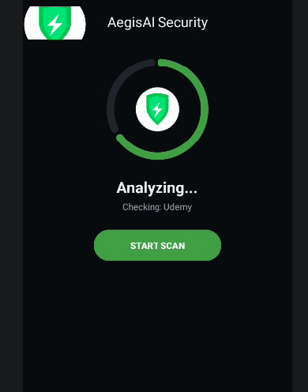
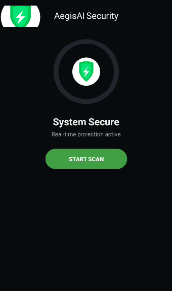
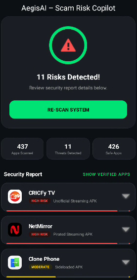
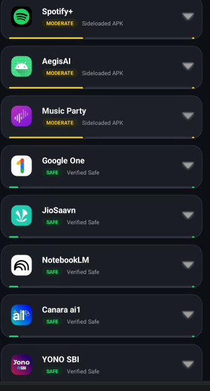
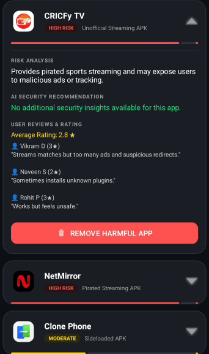
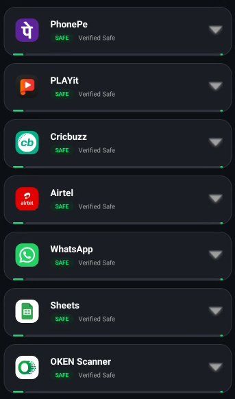

# AegisAI — AI-Powered Scam & Privacy Risk Detection for Android

## Overview

AegisAI is an AI-powered Android security assistant designed to help users identify fraudulent applications, privacy risks, and potentially harmful software installed on their devices.

The project was inspired by a growing real-world problem. Today, many investment, referral, reward-based, and finance-related applications appear legitimate and are often distributed through official app stores, social media platforms, and third-party APK websites. For students, first-time investors, and non-technical users, distinguishing between trustworthy and potentially dangerous applications has become increasingly difficult.

Additionally, many APKs and mobile applications request excessive permissions, collect sensitive user information, track user activity, or expose personal data without users fully understanding the risks involved.

AegisAI was developed to bridge the gap between cybersecurity awareness and everyday mobile users. The application scans installed applications, analyzes risk indicators, verifies installation sources, evaluates suspicious patterns, and provides clear explanations that help users understand potential threats before they become victims of scams, privacy violations, or malicious software.

By combining local threat intelligence, package verification, risk scoring mechanisms, explainable security insights, and semi-supervised risk analysis concepts, AegisAI empowers users to make safer digital decisions through a modern and user-friendly Android experience.

---

## Features

### Deep Package Inspection
- Scans installed applications on the device.
- Retrieves package metadata using Android PackageManager.
- Performs comprehensive security assessment of applications.

### AI-Powered Risk Analysis (Semi-Supervised Mode)
- Generates intelligent risk scores.
- Categorizes applications into Safe, Moderate Risk, and High Risk levels.
- Provides explainable threat assessments through heuristic pattern matching.

### High-Precision Play Store Trust & Anti-Phishing Logic
- Trusts official, verified installations of Banking, Payments, and Delivery apps from the Google Play Store (and trusted OEM stores), eliminating false positives.
- Flags sideloaded/unverified cloned apps (e.g., modified premium APKs, banking replicas) attempting to impersonate official brands as critical risks.

### Privacy Risk Assessment
- Evaluates privacy-related concerns.
- Detects applications requesting excessive or dangerous permissions (SMS, contacts, etc.).
- Improves user awareness regarding privacy threats.

### Threat Intelligence Analysis
- Utilizes local threat metadata.
- Matches applications against known risk indicators.
- Enhances detection of suspicious software.

### Security Dashboard
- Displays overall device security status.
- Shows risk distribution and threat summaries.
- Provides security insights through an intuitive interface.

### Threat Reports & Uninstallation Utility
- Detailed threat descriptions, risk scores, and classifications.
- Directly invokes secure system uninstallation flows to remove identified threats easily.

### Real-Time Protection Components
- Background monitoring mechanisms.
- Threat awareness through Android services.
- Broadcast receiver-based event handling.

### Local Scan History
- Stores scan reports locally.
- Allows review of previous analyses.
- Enables historical threat tracking.

### Premium Theme Support (Light & Dark Mode)
- Fully dynamic and responsive Day & Night themes.
- Crafted using Material Design 3 and a high-contrast palette for perfect readability.
- Seamless status bar inset handling to prevent overlaps.

---

## Screenshots

### Application Scan


### Security Dashboard


### Threat Detection Report


### Detailed Risk Analysis


### User Reviews and Reports


### Safe Applications


---

## Technology Stack

| Category | Technology |
|----------|------------|
| Language | Kotlin |
| Platform | Android |
| UI Framework | XML Layouts, ViewBinding |
| Design System | Material Design 3 |
| Security Analysis | Rule-Based Risk Engine |
| Risk Detection | Semi-Supervised Heuristics and Pattern Analysis |
| Data Storage | Shared Preferences |
| JSON Processing | Gson |
| Android APIs | PackageManager |
| UI Components | RecyclerView |
| Background Components | Services, Broadcast Receivers |
| Theme Support | Light Mode & Dark Mode |

---

## How It Works

1. Loads threat intelligence data from a local metadata database (`app_risk_metadata.json`).
2. Retrieves installed application information from the device.
3. Verifies installation sources and package signature metadata.
4. Evaluates privacy indicators and security attributes.
5. Applies risk scoring and threat detection mechanisms.
6. Analyzes suspicious patterns and known threat signatures.
7. Classifies applications into Safe, Moderate Risk, or High Risk categories.
8. Generates explainable threat reports and recommendations.
9. Displays results through an interactive dashboard.
10. Stores scan history locally for future reference.

---

## Project Structure

```text
app/src/main/
├── java/com/example/myapplication18/
│   ├── MainActivity.kt               # Main screen, layout controller and inset handler
│   ├── SecurityEngine.kt             # Supervised/unsupervised hybrid risk analysis algorithm
│   ├── AppRiskAdapter.kt             # RecyclerView Adapter supporting light/dark status markers
│   ├── AppRiskModel.kt               # Data definitions for scan results, metadata, and reviews
│   ├── ScamShieldService.kt          # Accessibility background scanning support
│   └── RealTimeShieldReceiver.kt     # Real-time application install monitoring
├── assets/
│   └── app_risk_metadata.json        # Local threat database and user feedback records
└── res/
    ├── drawable/
    │   └── ic_aegis_logo.xml         # Modern vector logo: shield with a lighting emblem
    ├── layout/                       # Edge-to-edge system layouts
    ├── values/                       # Themes, strings, and light/dark color definitions
    └── xml/
```

---

## Installation

### Clone the Repository

```bash
git clone https://github.com/Suchendra-018/Ageis-Scan-App.git
```

### Requirements

- Android Studio Hedgehog or newer
- Android SDK 34+
- Kotlin Support
- Android Emulator or Physical Device

### Build and Run

1. Open the project in Android Studio.
2. Sync Gradle dependencies.
3. Build the project.
4. Run on an Android emulator or physical device.

---

## Future Enhancements

- Advanced Machine Learning-Based Threat Prediction
- Cloud Threat Intelligence Integration
- Real-Time Permission Monitoring
- Dynamic Malware Behavior Analysis
- Community Threat Intelligence Platform
- Security Report Export
- Privacy Audit Dashboard
- AI-Powered Security Assistant
- Online Scam Intelligence Database
- URL and Website Risk Analysis
- APK Reputation Scoring System

---

## Motivation

The motivation behind AegisAI comes from the increasing number of fraudulent investment applications, referral-based scams, fake earning platforms, privacy-invasive APKs, and deceptive mobile applications targeting everyday users.

Many of these applications appear trustworthy and may even be available through official app stores, making them difficult to identify without technical knowledge. As mobile threats continue to evolve, users need accessible tools that can help them understand risks before installing or trusting an application.

AegisAI was created with the goal of protecting students, investors, and non-technical users by providing intelligent risk analysis, clear explanations, and practical security guidance through a simple and accessible mobile experience.

---

## Author

**Suchendra A**

Information Science Engineering Student

Areas of Interest:
- Android Development
- Cybersecurity
- Artificial Intelligence
- Machine Learning
- Software Engineering

---

### If you find this project useful, consider giving it a ⭐ on GitHub.
